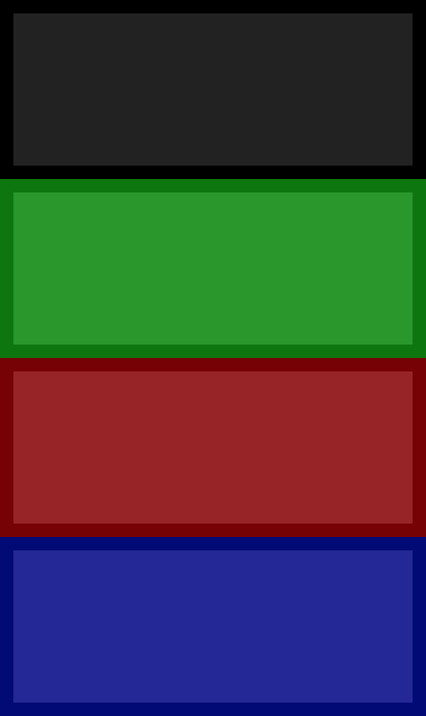

# Le jeu des boîtes

De quoi travailler le responsive design :smiley:

## Instructions

* Les boîtes doivent être placées les unes sous les autres (sur 4 lignes).

* à partir de 600px de large :
  + les boîtes doivent être affichées sur deux lignes, avec deux boites par ligne (2 colonnes par ligne).
  + la boîte noire et la boîte verte doivent échanger leurs places.

* à partir de 900px de large :
  + la boîte noire doit disparaître
  + les autres boîtes doivent se placer à côté les unes des autres (3 colonnes sur une ligne).

* à partir de 1200px de large :
  + la boîte noire doit apparaitre à nouveau
  + les 4 boîtes sont dorénavent toutes à côté les unes des autres (4 colonnes sur une ligne).

